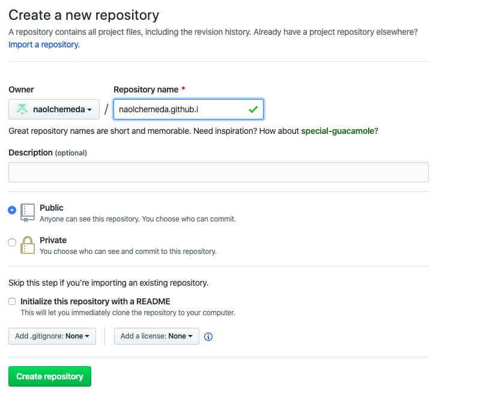
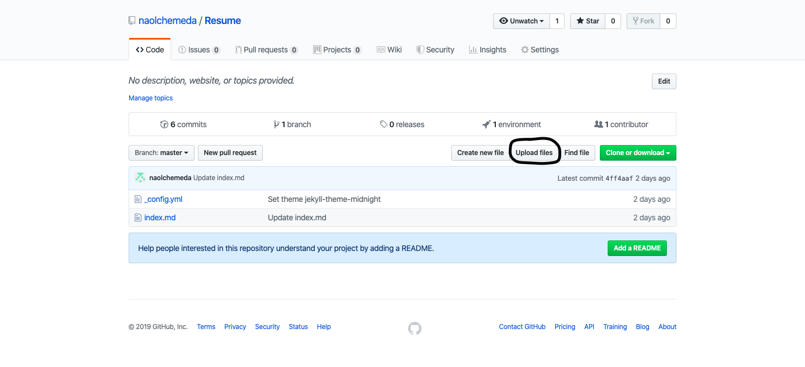
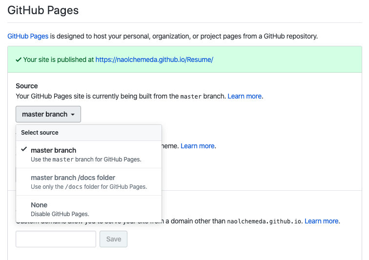
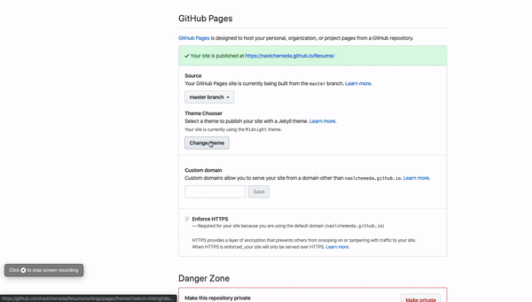

# How to Host Your Resume on GitHub Pages

Are you tired of uploading your resume PDF file for every job application? Instead use GitHub and Jekyll to host your resume on a static website showcasing your understanding and use of new technology to your employer.

### Who is this for?

If you are a novice at using GitHub especially GitHub Pages and Jekyll, this is a perfect instruction set to follow along. We will be hosting a markdown resume to GitHub Pages and format it using Jekyll. At the end, you will have a good grasp on the idea of using GitHub Pages and Jekyll themes. In addition, you will be able to host your resume on a static website without complex coding.

### Prerequisites

You will need a [GitHub](https://www.github.com/) account and markdown version of your resume. Rename your markdown resume as `index.md`. Now you might be asking "*why don't I name it Resume.md or anything else?*" The reason is when we use Jekyll (discussed later), it has a hard time applying themes if we use a different file name.

### 1. Create a public repository

Once you have created your github account, go to https://github.com/new to create your repository. You can name your repository anything you want but for our example I named it `[my GitHub id].github.io`. Then leave the other settings as they are and click on **Create repository**.



### 2. Uplaod your markdown resume file

After you have created your repository, you will need to upload your resume using the **"Uplaod files"** button.



After you have chosen your file, at the bottom of the page click on **Commit changes**. Perfect! Now you have succefully added your resume to your GitHub.

### 3. Host your repository on GitHub pages

GitHub pages is a powerful tool you can use to host your static website or your project directly from your GitHub repository. Go to **Settings** from your repository and scroll down to **GitHub pages**. Next, under **Source**, choose **master branch**. This will apply our themes to the whole branch.



### 4. Choose a Jekyll theme

[Jekyll](https://www.jekyllrb.com/) is a tool we can use to transform plain text into static websites and/or blogs. Best part is that it comes integrated with GitHub. Now lets choose a theme for our static website. In the **GitHub pages** section, click on **Change theme**. You will now be able to see theme templates displayed on the top with the preview displayed at the bottom. Once you have selected a them you like, press on **Select theme** to finish.




### 5. View your static website

You are almost done! You can view your static website by going to **GitHub pages** section in the **Settings**. And click on the link provided. Alternatively, you can copy paste the link below and replace **[YOUR GitHub ID]** with your GitHub id. __**Note**__: Jekyll themes can be a bit slow to update so after choosing a theme wait a couple of seconds and refresh the page.

```
https://[YOUR GitHub ID].github.io/Resume/

```

### 6. Change resume title

The final step is to change your resume title. If you view your static site now, it'll show your repository name as the resume title. To change the title follow these steps:
* Go to your YML file. For me the file is `_config.YML`
* Click on the edit button (:pencil2:)
* Right after `theme: jekyll-theme-SELECTED THEME`, add `title: YOUR TITLE`
* Commit changes
* You are done!!!


### More Resources

* Want to know more about GitHub: https://bit.ly/360sf90
* More info on GitHub Pages: https://bit.ly/2NgKNtg
* Learn more about Jekyll: https://bit.ly/2pN6JnA

### Authors and Acknowledgments

* **Naol Chemeda** - Author - https://bit.ly/2NdyYnh
* **Jasmin Bissonnette** - Group member
* **Billie Thompson** - README template credit - https://bit.ly/2MKEf76

### FAQs

**Question**: After deploying my website, will my resume be viewed by the public?

**Answer**: Yes, your website is available to be viewed by the public. It is a good practice not include personal information such as addresss and phone number. Instead, you can include your city for address and email for contact purposes.


**Question**: Why is Jekyll static?

**Answer**: The simple answer is to reduce complexity and increase speed. There is no backend server we need to develop for static websites. Consequently, our website can load up faster because we do not have a backend server. Most importantly, Jekyll integration with Github makes it easier to roll back changes.
