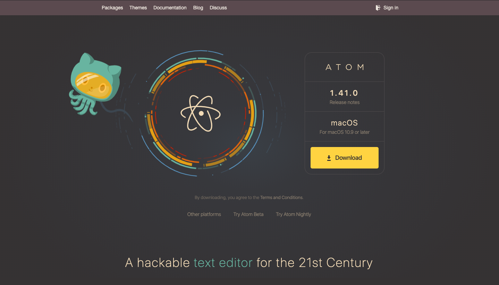

# How to Host Your Resume on GitHub Pages


Are you tired of uploading your resume PDF file for every job application? Instead, use GitHub and Jekyll to host your resume on a static website showcasing your understanding and use of new technology to your employer.

### Who is this for?

If you are a novice at using GitHub especially GitHub Pages and Jekyll, this is a perfect instruction set to follow along. You will be able to convert your resume to a markdown version. In addition, you will be hosting your markdown resume to GitHub Pages and format it using Jekyll. In the end, you will have a good grasp on the idea of using GitHub Pages and Jekyll themes. Furthermore, you will be able to host your resume on a static website without complex coding.

### Prerequisites

You will need:
- [GitHub](https://www.github.com/) account and
- Resume

### What is Markdown?

Markdown is a lightweight markup language with plain text formatting. It is similar to HTML except with markdown you don't have to worry about opening and closing tags. In addition, it is much simpler than HTML. It has a `.md` or `.markdown` extension.

Now let us convert your resume into a markdown version. To do this, you will need a text editor such as; **Atom**, **Sublime**, **Visual Basics** or any text editor. I will be using Atom but you can use any text editor you want.

## Instructions on making a resume using markdown

### 1. Download Atom

Atom will be the text editor we will use to make a resume in markdown. All you need to do is go to [atom.io](https://atom.io/) and press on the download button
shown here:



Depending on your operating system, Atom will download the right version. Consequently, install it as you would with any software.

### 2. Get familiar with markdown

Markdown has a variety of syntaxes. They enable you to format and write your document in a re-usable and easily readable way. Here are some of the basic syntax you will need to make your resume in markdown:

|     Element   | Markdown Syntax |
| ------------- | --------------- |
|   Heading     | # heading 1 <br > ## heading 2 <br > ### heading 3   |
|    Bold       | ** bold text **   |
|    Italic     | * italicized text *   |
|  Blockquote   |  > blockquote   |
| Ordered List  | 1. First item <br > 2. Second item <br > 3. Third item |
| Unordered List | - First item <br > - Second item <br > - Third item  |
| Horizontal Rule | ---    |
|   Link        | [title] (https://www.title.com)  |
|   Image       | ![alt text] (image.jpg)  |

These are just some of the syntaxes markdown contains. By following these syntaxes and using Atom text editor, you should be able to make your resume in markdown.

### 3. Write your resume in markdown

**Pro-tip**: if you want to view your markdown live while you are working on it, go to Packages > Markdown Previews > Toggle Preview. This will give you a preview of your markdown on the right side while you are working on it on the left side.

You might be thinking "*It's not as pretty as my PDF resume file*." You would be right thinking that but that's why you will use Jekyll later to make it look good. After you are done writing your resume, save it as `index.md`. The reason naming it as such is that when using Jekyll (discussed later), it has a hard time applying themes when using a different file name.

Perfect! you have successfully made a markdown resume named `index.md`. Next, we will discuss on how to post it on GitHub Pages and use Jekyll.


### What is GitHub and GitHub Pages?

[GitHub](https://www.github.com/) is a code hosting platform that lets developers collaborate and keep track of changes made on a project. The old school way was e-mailing large files between developers to communicate changes to a program. However, GitHub makes it easy to store and share code on one platform.

[GitHub Pages](https://pages.github.com/) is a powerful tool you can use to host your public website or your project directly from your GitHub repository. Usually, if you want to make a website for yourself, you will need to purchase a domain to put your website on. However, GitHub Pages is free and you can use it to put up your blog or a website.

Next, follow these steps to host your `index.md` file on GitHub Pages.

## Instructions on hosting you resume on GitHub Pages

### 1. Create a public repository

Once you have created your GitHub account, go to https://github.com/new to create your repository. You can name your repository anything you want but for our example name it `[your GitHub id].github.io`. Then leave the other settings as they are and click on **Create repository**.


### 2. Upload your markdown resume file

After you have created your repository, you will need to upload your `index.md` file using the **Upload files** button.


After you have chosen your file, at the bottom of the page click on **Commit changes**. Perfect! Now you have successfully added your resume to your GitHub.

### 3. Change source for your GitHub Pages

Go to **Settings** from your repository and scroll down to **GitHub pages**. Under **Source**, choose **master branch**. This will apply your theme to the whole branch.


### 4. Choose a Jekyll theme

[Jekyll](https://www.jekyllrb.com/) is a tool you can use to transform plain text into static websites and/or blogs. The best part is that it comes integrated with GitHub. Now, let us choose a theme for our static website. In the **GitHub pages** section, click on **Change theme**. You will now be able to see theme templates displayed on the top with the preview displayed at the bottom. Once you have selected a them you like, press on **Select theme** to finish.


### 5. View your static website

You are almost done! You can view your static website by going to **GitHub pages** section in the **Settings**. And click on the link provided. Alternatively, you can copy paste the link below and replace **[YOUR GitHub ID]** with your GitHub id.

```
https://[YOUR GitHub ID].github.io/Resume/

```

**Note**: Jekyll themes can be a bit slow to update so after choosing a theme wait a couple of seconds and refresh the page.

### 6. Change your theme title

The final step is to change your theme's title. If you view your static site now, it'll show your repository name as the resume title. To change the title follow these steps:
* Go to your YML file. For me, the file is `_config.YML`
* Click on the edit button (:pencil2:)
* Right after `theme: jekyll-theme-SELECTED THEME`, add `title: YOUR TITLE`
* Commit changes
* You are done!!!


### More Resources

* Want to know more about GitHub: https://bit.ly/360sf90
* More info on GitHub Pages: https://bit.ly/2NgKNtg
* Learn more about Jekyll: https://bit.ly/2pN6JnA

### Authors and Acknowledgments

* **Naol Chemeda** - Author - https://bit.ly/2NdyYnh
* **Jasmin Bissonnette** - Group member
* **Hunain Muneer** - Group member
* **Billie Thompson** - README template credit - https://bit.ly/2MKEf76

### FAQs

**Question**: After deploying my website, will my resume be viewed by the public?

**Answer**: Yes, your website is available to be viewed by the public. It is a good practice not include personal information such as address and phone number. Instead, you can include your city for address and email for contact purposes.


**Question**: Why is Jekyll static?

**Answer**: The simple answer is to reduce complexity and increase speed. There is no backend server you need to develop for static websites. Consequently, your website can load up faster because you do not have a backend server. Most importantly, Jekyll integration with Github makes it easier to roll back changes.

